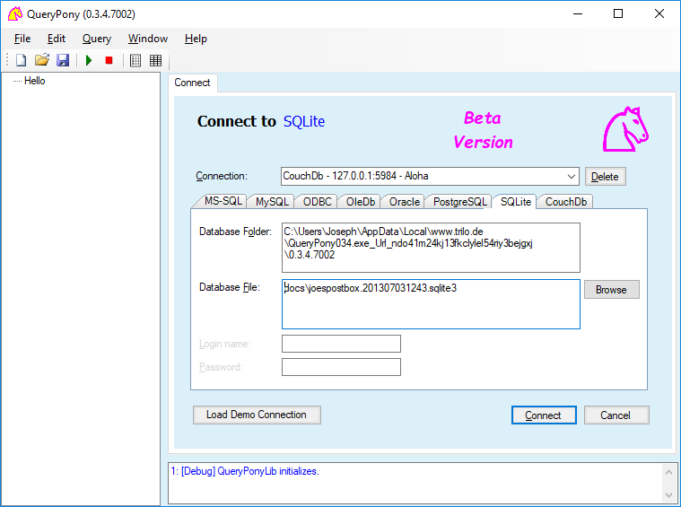
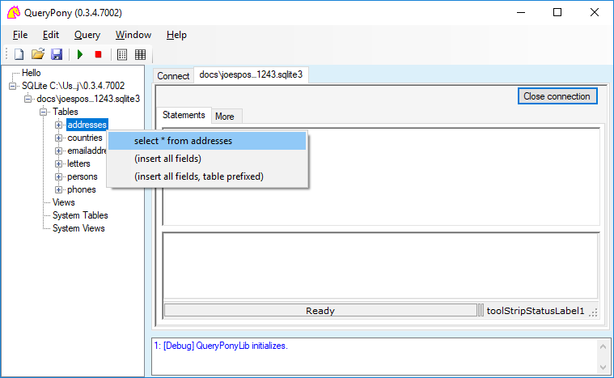
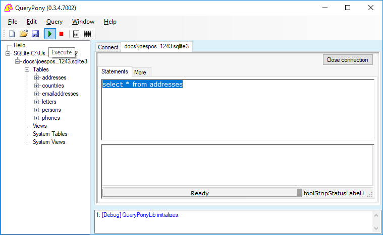
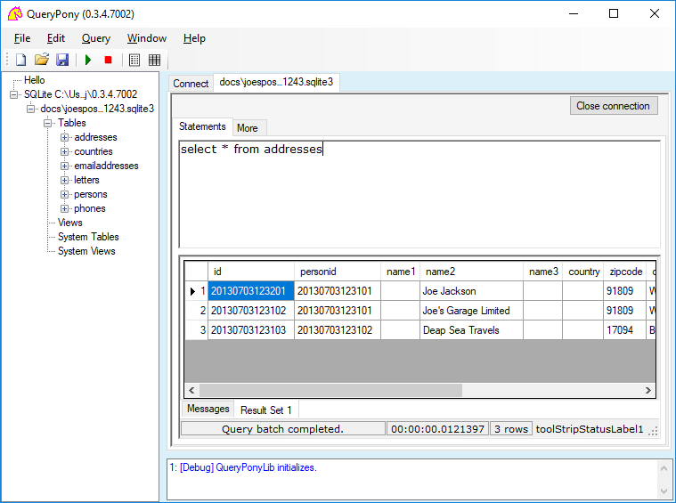
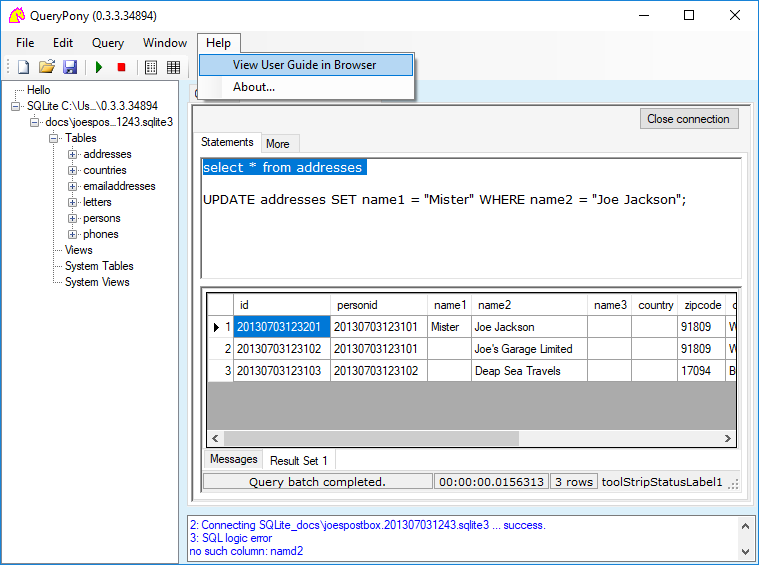
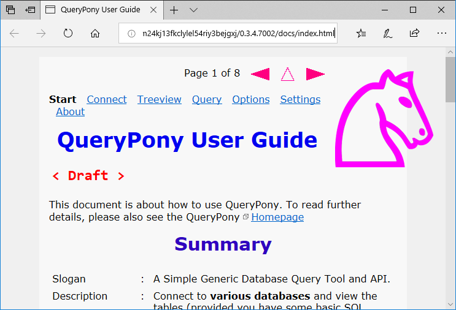
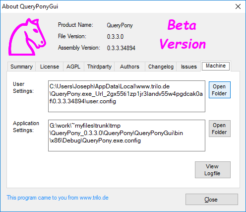

# QueryPony

**Slogan** : A Simple Generic Database Query Tool and API

**Places** : [Homepage](http://downtown.trilo.de/svn/queryponydev/trunk/home/index.html) — [Downloads](http://downtown.trilo.de/svn/queryponydev/downloads/) — [UserGuide](http://downtown.trilo.de/svn/queryponydev/trunk/querypony/QueryPonyGui/docs/index.html)

**Status** : Proof-of-concept

**Highlight** : API utilizable from any .NET program

## Quickstart

Aloha folks, it goes like follows.

[Download](http://downtown.trilo.de/svn/queryponydev/downloads/) the executable and start it.

Select the 'SQLite' tab. Press 'Local Demo Connection'. Nod the turning up dialog.

Now the entries for a demo database 'joespostbox.201307031243.sqlite3'
 should appear.



Press the 'Connect' button and beeee patient (e.g. 30 seconds).

If the connection is established, it will be shown as a new node in the
 left side tree view.

Expand the tree and rightclick a table.



Select the top item of the turned up context menu.

Now in the 'Statements' pane, a SQL select statement shall be written.



Press the 'Execute' toolbar button (the green triangle) or F5.

The statement will be executed, and the result will be shown in the
 ResultSet pane.



View the result of your SQL statement.

To edit the table, write/mark/execute an appropriate SQL update
 statement. E.g.:

```
 UPDATE addresses SET name1 = "Mister" WHERE name2 = "Joe Jackson";
```



Of course you also want inspect the meager offline User Guide,
 which will show up in your default browser.



Holla, where do those pages come from? How can the browser show
 HTML files which did not even exist?

To resolve this riddle, seek some hint from the 'About' dialog.
 Open the User Settings folder, and you will see.



Yep, now you also have found the two folders, which you must
 delete, once you get tired of QueryPony and want purge it
 from your machine without any residues.

Try, play, explore, have fun, get mad!

Please mind: This is beta — never cherish expectations.

Otherwise you are welcome to study the code and contribute.

Goodbye,

Norbert

BTW. What I find much more fascinating than above described cruelsome
 GUI, is the __engine__ with it's database agnostic API, usable from any
 other .NET program.

So if the customer for your latest cool business application is asking
 'Which database does your application need?', perplex her with the
 laconic answer: __'Any'__.

*2018-August-19*

*eof*

<!-- [pg 20180819°0331] -->
