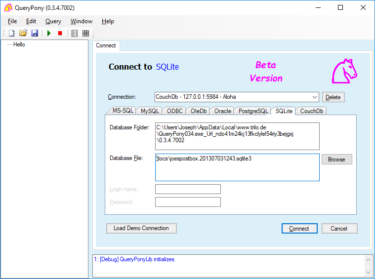
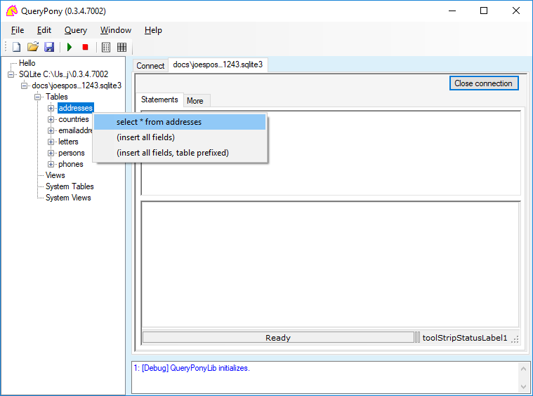
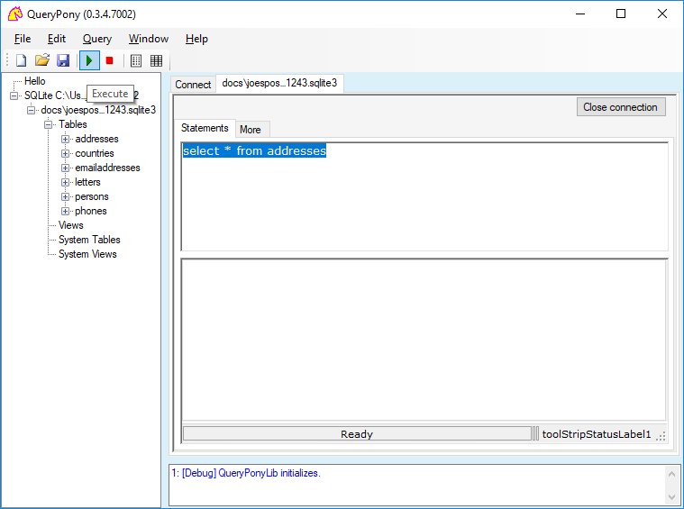
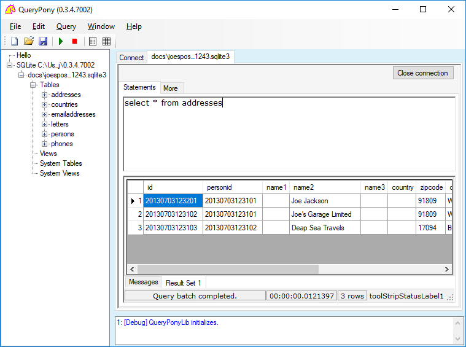

# QueryPony

**Slogan** : A Simple Generic Database Query Tool and API

**Places** : [Homepage](http://downtown.trilo.de/svn/queryponydev/trunk/home/index.html) — [Downloads](http://downtown.trilo.de/svn/queryponydev/downloads/) — [UserGuide](http://downtown.trilo.de/svn/queryponydev/trunk/querypony/QueryPonyGui/docs/index.html)

**Status** : Proof-of-concept

## Quickstart

[Download](http://downtown.trilo.de/svn/queryponydev/downloads/) the executable and start it.

Select the SQLite tab. Press 'Local Demo Connection'. Nod the dialog.

Now entries for a demo database 'joespostbox.201307031243.sqlite3' should appear.

Press the 'Connect' button and beeee patient (e.g. 30 seconds).

If the connection is established, it will be shown as a new node in the left side tree view.

Expand the tree and rightclick a table.

Select the top item of the turned up context menu.

Now in the Statements pane, a SQL select statement shall be written.

Press the Execute toolbar button (the green triangle) or F5.

The statement will be executed, and the result will be shown in the ResultSet pane.

View the result of your SQL statement.

To edit the fields, you have to write an appropriate SQL update statement, and execute it.

Try, play, explore.

Please mind: it is a beta version — have no expectations.

Otherwise you are welcome to study the code and contribute.

Have fun,
Norbert

<small>*2018-August-19* <small>Äöüß</small></small>

<small><small><small>*[pg 20180819°0331]*</small></small></small>
